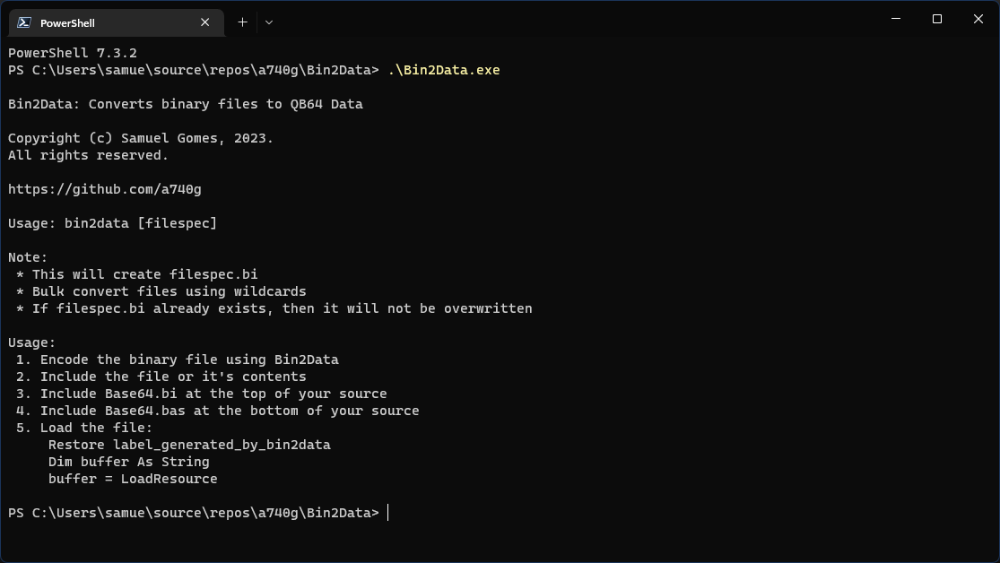

# BIN2DATA

Bin2Data and it's companion library is written in [QB64-PE](https://github.com/QB64-Phoenix-Edition/QB64pe), that allows for the conversion of binary files to Base64 encoded `DATA` statements. This library not only encodes binary data into Base64, but also allows for the decoding of Base64 encoded data back into its binary form. The data is optionally compressed using QB64's `DEFLATE$` if it sees any goodness. This means that files that are already compressed, may not go through one more compression step.



With this library, you can easily store binary data within your QB64 programs, making it easier to distribute and maintain the files required for your program to run. The library provides a simple API that you can use to perform encoding and decoding operations with just a few lines of code.

## FEATURES

* Encode binary files to Base64 encoded DATA statements.
* Decode Base64 encoded data back into binary form.
* Simple API that makes it easy to use.

## USAGE

* Clone the repository to a directory of your choice
* Open Terminal and change to the directory using an appropriate OS command
* Run `git submodule update --init --recursive` to initialize, fetch and checkout git submodules
* Open *Bin2Data.bas* in the QB64-PE IDE and press `F5` to compile and run
* To use the library in your project add the [Toolbox64](https://github.com/a740g/Toolbox64) repositiory as a [Git submodule](https://git-scm.com/book/en/v2/Git-Tools-Submodules)
* Then, simply include the library files in your QB64 program and call the relevant functions to perform encoding and decoding operations.

Assuming the a file has been encoded using Bin2Data, here's an example of how you can use the library to to decode Base64 encoded data.

```vb
' In this example we used Bin2Data on my_music.mp3 and it create a file called my_music.mp3.bi

'$Include:'./include/Base64.bi'

Restore Data_my_music_8192  ' this label is from my_music_mp3.bi
Dim As String buffer
buffer = LoadResource

' Now do something with buffer
...

' Place contents of my_music_mp3.bi here
Data_my_music_8192:
Data 8192,9877,0
Data ...

'$Include:'./include/Base64.bas'
```

## API

```vb
Function EncodeBase64$ (s As String)
Function DecodeBase64$ (s As String)
Function LoadResource$
```

## NOTES

* This requires the latest version of [QB64-PE](https://github.com/QB64-Phoenix-Edition/QB64pe)
* When you clone a repository that contains submodules, the submodules are not automatically cloned by default
* You will need to use the `git submodule update --init --recursive` to initialize, fetch and checkout git submodules

## ASSETS

* [Icon](https://www.iconarchive.com/artist/umut-pulat.html) by [Umut Pulat](http://12m3.deviantart.com/)
